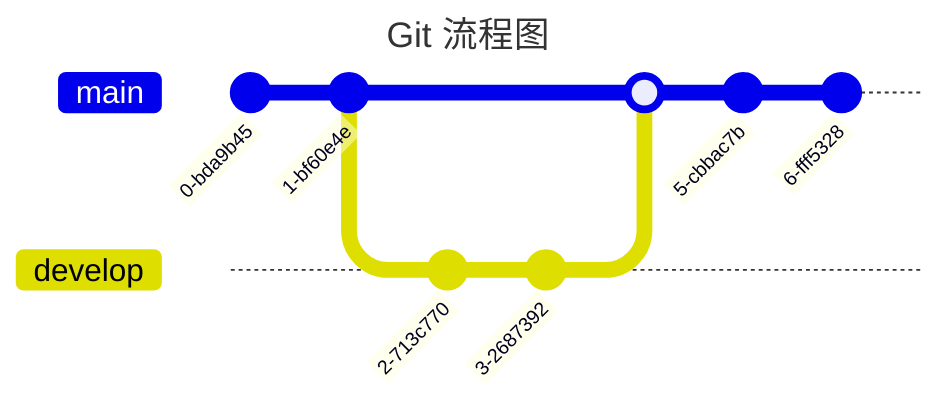

# 一级标题
## 二级标题
### 三级标题
#### 四级标题
##### 五级标题
###### 六级标题

---

正常正文

**加粗正文**

*倾斜正文*

~~删除正文~~

<u>下划线正文</u>


---

脚注示例，这是一个 Markdown[^1] 文本

> 引用示例
> > 嵌套引用示例

行内代码 `printf()` 示例

```kotlin
/**
 * 代码示例
 * */
class Test {
    private val aa = "hello"
}
```
---

有序列表

1. 测试测试
2. 测试测试
3. 测试测试

无序列表

- 测试测试
- 测试测试
- 测试测出


---

[链接示例](https://www.baidu.com)

<https://www.runoob.com>

---

这是一个图片示例


---

表格（默认左对齐）

| 一 | 二 | 三 | 左对齐 | 右对齐 | 居中对齐 |
| - | - | - | :- | -: | :-: |
| 1 | 2 | 3 | A | A | A |
| 4 | 5 | 6 | B | B | B |
| 7 | 8 | 9 | C | C | C |

---
支持 Html 元素

`<kbd>`：<kbd>Ctrl</kbd> + <kbd>Alt</kbd> + <kbd>T</kbd>

`<b>`：<b>文本加粗</b>

`<i>`：<i>文本倾斜</i>

`<em>`：<em>文本倾斜</em>

`<sup>`：一段演示文本<sup>脚注</sup>

`<sub>`：一段演示文本<sub>脚注</sub>

转义字符 

正常显示星号 \*

公式

行内公式

$f(x) = sin(x) + 12$

块内公式

$$
\begin{Bmatrix}
   a & b \\
   c & d
\end{Bmatrix}
$$

---
Github 中支持了 `mermaid` 绘图工具，用于绘制流程图、甘特图等

> 注意：此特性不是所有的 markdown 解释器都会支持！




[^1]: Markdown是一种纯文本标记语言
